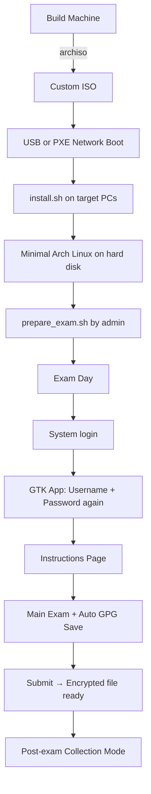

<p align="center">
  
  
  
</p>

<h1 align="center">🔒 Hope — Autonomous Exam OS</h1>

<p align="center">
  <strong>A Secure Operating System For High-Stakes Examinations</strong><br/>
  <em>Built so no exam, ever again, has to be cancelled.</em>
</p>

<p align="center">
  <a href="https://aditisingh0102.github.io/trust-exam-shield/">🌐 Live Demo</a> ·
  <a href="#architecture">🏗️ Architecture</a> ·
  <a href="#security">🛡️ Security</a> ·
  <a href="#tech-stack">⚙️ Tech Stack</a> ·
  <a href="#team">👥 Team</a>
</p>

---

## 📋 Table of Contents

- [The Problem](#the-problem)
- [What is Hope?](#what-is-hope)
- [Key Features](#key-features)
- [Architecture](#architecture)
- [Security Model](#security)
- [Performance](#performance)
- [Tech Stack](#tech-stack)
- [Getting Started](#getting-started)
- [Deployment](#deployment)
- [Project Structure](#project-structure)
- [Team](#team)
- [License](#license)

---

## 🚨 The Problem

India's examination system faces a systemic security crisis:

| Vulnerability | Impact |
|---|---|
| **Paper printed early** | Physical question papers exist weeks before the exam, vulnerable to leaks at any point in the human supply chain |
| **Same paper for everyone** | One leaked copy compromises the entire exam for millions of students |
| **No real identity check** | Solver gangs and impersonators enter exam centers using fake or borrowed IDs |
| **Zero audit trail** | After every scandal, authorities claim "no evidence" because records are centralized and editable |

These aren't NEET-specific problems. These are **every-exam** problems — affecting JEE, CUET, SSC, banking exams, university finals, and professional certifications.

---

## 💡 What is Hope?

**Hope** is an autonomous examination platform designed to prevent paper leaks, impersonation, cheating, and submission tampering at the **operating system level**. It replaces the entire exam delivery chain — from question distribution to answer submission — with cryptographically secured, mathematically provable integrity.

### Scale

- **50,000+** examinations conducted annually
- **25M+** students assessed
- **100%** tamper-proof rate — zero security breaches

---

## ✨ Key Features

### 🔐 Time-Locked AES-256 Encryption
Question papers are stored in fragmented AES-256 blocks across servers. Decryption keys release autonomously to clients strictly at T=0 — no human ever sees the paper early.

### 🤖 AI Autonomous Paper Synthesis
A local agent generates individualized question sequences for every student — identical syllabus weight and difficulty, completely different questions. Mass copying becomes obsolete.

### 🪪 Cryptographic 2FA Hardware Pairing
Every student gets a hardware-encrypted USB Identity Token that must stay plugged in, continuously validated against a live OpenCV face-recognition agent.

### 🖥️ Locked Kiosk Environment
A full-screen custom GTK application with no desktop, no terminal, and no escape — deployed identically to hundreds of machines. Only 3 processes run total.

### 📝 GPG-Encrypted Timestamped Submissions
Every answer auto-saves and encrypts every few seconds, finalized into a tamper-proof file on submission with complete audit trails.

### 👁️ AI Behavioral Monitoring Agents
Local agents continuously watch for anomalies — gaze tracking, keystroke patterns, and process monitoring flag irregularities in real time.

---

## 🏗️ Architecture

Hope uses a **4-layer security architecture**:

```
┌──────────────────────────────────────────────────┐
│  Layer 1: Hardware & Console Boot (tty1)         │
│  → Locked black terminal → password → kiosk      │
├──────────────────────────────────────────────────┤
│  Layer 2: Monolithic Application Isolation       │
│  → Isolated Xorg → Full-screen GTK app           │
├──────────────────────────────────────────────────┤
│  Layer 3: Administrative Rules & Pledge Panel    │
│  → Instructions, duration, anti-malpractice laws │
├──────────────────────────────────────────────────┤
│  Layer 4: Active Examination Canvas              │
│  → Split-screen: questions (read-only) + editor  │
│  → Countdown timer + auto-save encryption        │
└──────────────────────────────────────────────────┘
```

### Boot Sequence

```bash
ExamOS 2.0 [tty1]
login: exam2026-042
password: ●●●●●●●●●●
→ launching kiosk-wrapper.sh
→ starting isolated Xorg layer...
✓ session locked
```

---

## 🛡️ Security

| Layer | Technology | What It Does |
|---|---|---|
| **OS Kernel** | Custom hardened Arch Linux | Stripped to bare metal — no desktop, no terminal, no window manager |
| **Authentication** | PAM + GPG | Two-layer login with hardware token validation |
| **Encryption** | AES-256 + GPG | Time-locked question delivery + tamper-proof submissions |
| **Identity** | OpenCV + Hardware Tokens | Continuous face recognition + plugged-in USB identity validation |
| **Monitoring** | AI Behavioral Agents | Gaze tracking, keystroke analysis, process monitoring |
| **Network** | Air-gapped + PXE | Offline exam delivery via local server boot |

---

## ⚡ Performance

Hope is **25× lighter** than traditional exam setups:

| Metric | Windows 11 + Exam Browser | Ubuntu Desktop | **Hope ExamOS** |
|---|---|---|---|
| **RAM Usage** | 3,800 MB | 2,100 MB | **150 MB** |
| **Processes** | 180+ | 95+ | **3** |
| **Boot Time** | 45s | 28s | **8s** |
| **Attack Vectors** | 12 | 7 | **0** |

---

## ⚙️ Tech Stack

### Exam OS (Backend System)

| Technology | Purpose |
|---|---|
| **Arch Linux** | Minimal, hardened base operating system |
| **GTK 4** | Monolithic kiosk application UI |
| **Xorg** | Isolated display server (no desktop environment) |
| **PAM** | Pluggable Authentication Module for 2FA |
| **GnuPG** | Submission encryption & signing |
| **OpenCV** | Real-time face recognition agent |
| **Python** | AI behavioral monitoring agents |
| **Bash** | System scripts (`kiosk-wrapper.sh`, `install.sh`) |

### Presentation Website (This Repository)

| Technology | Purpose |
|---|---|
| **React 19** | UI framework |
| **TypeScript** | Type-safe development |
| **TanStack Router** | File-based routing |
| **TanStack Start** | SSR/SSG framework |
| **Vite 8** | Build tooling & dev server |
| **Tailwind CSS 4** | Utility-first styling |
| **Framer Motion** | Animations & transitions |
| **Three.js / R3F** | 3D background effects |
| **Lucide React** | Icon system |
| **Radix UI** | Accessible component primitives |
| **shadcn/ui** | Pre-built component library |

---

## 🚀 Getting Started

### Prerequisites

- **Node.js** ≥ 18
- **npm** or **bun**

### Installation

```bash
# Clone the repository
git clone https://github.com/Aditisingh0102/trust-exam-shield.git
cd trust-exam-shield

# Install dependencies
npm install
# or
bun install

# Start development server
npm run dev
```

### Available Scripts

| Command | Description |
|---|---|
| `npm run dev` | Start the Vite development server |
| `npm run build` | Build for production |
| `npm run preview` | Preview the production build |
| `npm run lint` | Run ESLint |
| `npm run format` | Format code with Prettier |
| `npm run deploy` | Build and deploy to GitHub Pages |

---

## 📦 Deployment

Hope's presentation website is deployed to **GitHub Pages**. The deployment process:

1. Builds the production bundle via Vite
2. Starts a preview server to generate static HTML
3. Captures the rendered HTML for SPA fallback
4. Deploys the `dist/client` directory via `gh-pages`

```bash
# One-command deploy
npm run deploy
```

### ExamOS Deployment (Production)

The actual exam operating system supports two deployment modes:

**USB Flash Install**
```bash
$ ./install.sh --target /dev/sda
→ wiping local partition...
→ flashing hardened Arch base...
→ installing kiosk-wrapper.sh + GTK app...
→ sealing system with read-only root...
✓ ExamOS kiosk ready. Reboot to begin.
```

**PXE Network Boot**
- High-speed network booting for hundreds of lab computers simultaneously
- Single offline local server inside the exam center
- No individual physical media needed

---

## 📁 Project Structure

```
trust-exam-shield/
├── src/
│   ├── components/
│   │   ├── hope/               # Main application components
│   │   │   ├── HopePage.tsx    # Primary page (all sections)
│   │   │   ├── Background.tsx  # Animated background + utility hooks
│   │   │   └── ThreeSphere.tsx # 3D sphere effect (Three.js)
│   │   └── ui/                 # shadcn/ui component library (46 components)
│   ├── routes/
│   │   ├── __root.tsx          # Root layout with meta tags & fonts
│   │   └── index.tsx           # Home route → HopePage
│   ├── hooks/                  # Custom React hooks
│   ├── lib/                    # Utility functions
│   ├── router.tsx              # TanStack Router configuration
│   ├── styles.css              # Global styles & Tailwind imports
│   └── routeTree.gen.ts        # Auto-generated route tree
├── deploy.sh                   # GitHub Pages deployment script
├── vite.config.ts              # Vite + TanStack Start configuration
├── tsconfig.json               # TypeScript configuration
├── components.json             # shadcn/ui configuration
└── package.json                # Dependencies & scripts
```

---

## 👥 Team

**Team GrowMore** — Five builders. Four days. One mission.

| Name | Role |
|---|---|
| **Aditi Singh** | Frontend Developer |
| **Ansh Gupta** | Application Developer/Design |
| **Ambar Kumar** | UI/UX |
| **Rahul Rawat** | Blockchain & Research |
| **Apurv Singh** | OS/System Design |

---

## 🏆 Built For

**FAR AWAY 2026** — A hackathon project addressing India's examination integrity crisis with OS-level security architecture.

---

# Secure Minimal Arch Linux Exam Kiosk System

**examos** — A custom, extremely minimal, offline, and strictly locked-down Arch Linux-based exam system for national-level examinations.

Built step-by-step from scratch with security and simplicity as top priorities.

---

## Project Goal

We are building a secure exam environment that:
- Is extremely minimal (only essential components)
- Boots into a locked-down kiosk mode
- Requires student login with username + password
- Launches a custom GTK application with double authentication
- Shows examination instructions before the exam starts
- Allows students to type answers with real-time GPG encryption
- Enforces **zero admin access** during the exam
- Supports controlled collection of encrypted answers only after the exam
- Can be deployed on hundreds of computers via USB or PXE
- Is fully documented and easy to reproduce

---

## Current Status

**Phase 1: Planning & Architecture — Completed**

All core decisions have been finalized:
- Installation method: Full install to hard disk
- Deployment: USB + PXE network boot
- Encryption: GPG (OpenPGP)
- Application flow: System login → App login (username + password again) → Instructions page → Main exam
- Strict lockdown model designed

---

## How the Student Experience Works

1. Computer boots → Text login prompt appears
2. Student enters **username + password**
3. GTK exam application opens in full screen
4. **Inside the app**: Student enters **username + password again** (second authentication)
5. **Examination Instructions** page appears (rules, duration, do’s and don’ts)
6. Student agrees and clicks **Start Exam**
7. Main exam interface starts:
   - Countdown timer
   - Questions displayed
   - Answer typing area
   - Auto GPG encryption + saving every few seconds
   - Submit button
8. Exam ends → Encrypted answer file is ready for collection

---

## Architecture Overview


---
## 📄 License

This project is private and proprietary to Team GrowMore.

---

<p align="center">
  <strong>Hope</strong> — Built so no exam, ever again, has to be cancelled.<br/>
  <sub>© 2026 Team GrowMore. All rights reserved.</sub>
</p>
